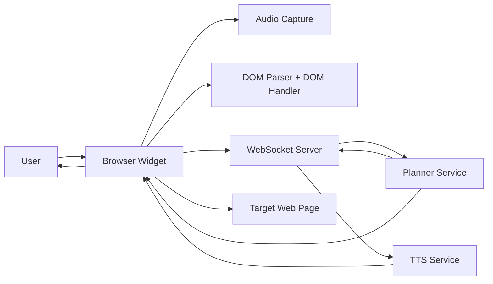
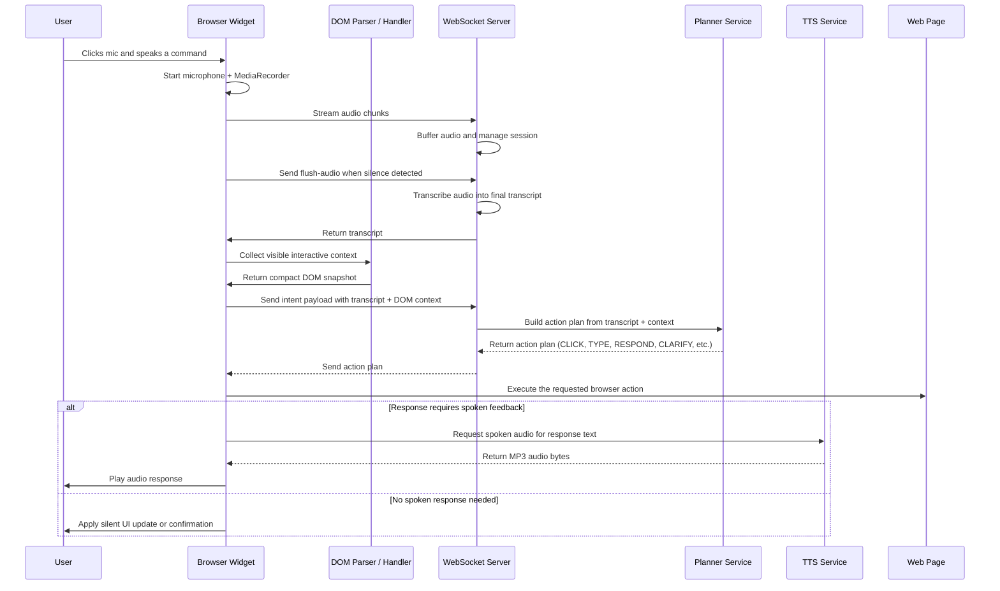
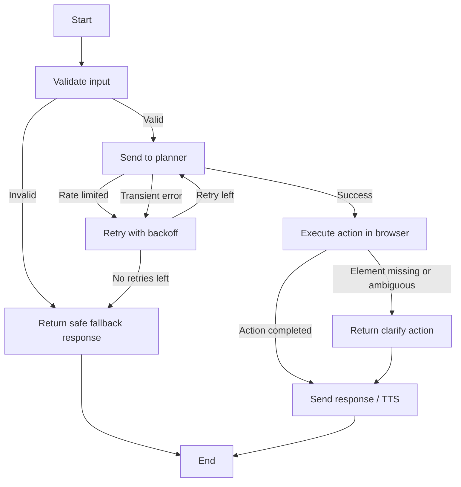

# Technical Design Document

## 1. Overview

This project implements a voice-first browser automation platform. The system accepts spoken user input, interprets the intent within the current page context, executes an appropriate browser action, and returns spoken or visual feedback.

At a high level, the solution combines three capabilities:

1. Voice input and transcription
2. Intent planning and action selection
3. Browser execution and spoken response

The architecture is designed to be modular, resilient, and efficient for both small pages and large interactive applications.

---

## 2. System Goals

The system is intended to achieve the following goals:

- Enable hands-free interaction with web applications through voice
- Translate natural-language requests into actionable browser operations
- Use page context and project context to improve task accuracy
- Support both action execution and informational responses
- Minimize latency while preserving reliability
- Handle ambiguous or incomplete requests safely through clarification flows
- Provide graceful fallback behavior when transcription, planning, or speech services are temporarily unavailable

### Primary Use Cases

- Clicking or focusing interface controls
- Filling forms and selecting options
- Scrolling and navigating the page
- Summarizing or reading page content
- Responding to informational questions such as “What does this form require?”

---

## 3. Constraints and Assumptions

| Constraint                             | Impact on Design                                                                       |
| -------------------------------------- | -------------------------------------------------------------------------------------- |
| Browser-only execution environment     | DOM interactions must be implemented using client-side browser APIs                    |
| Limited payload size for LLM reasoning | The system must prune and compress DOM context before sending it to the planner        |
| External service dependency            | Transcription, planning, and TTS components must support retries and fallback handling |
| Ambiguity in user intent               | The planner must sometimes produce CLARIFY actions instead of guessing                 |
| Cross-page variability                 | The DOM parser must identify interactive controls robustly across different websites   |
| Real-time interaction expectations     | Audio capture and response generation must be optimized for responsiveness             |

### Design Assumptions

- The system will operate in a browser context where microphone access and DOM inspection are available.
- The backend can access project metadata and persist interaction logs.
- The planner may be given a compact but relevant subset of the page rather than the full DOM tree.

---

## 4. High-Level Architecture

The solution is divided into a browser runtime layer and a server-side orchestration layer.

### Browser Layer

Responsibilities include:

- Capturing microphone input
- Streaming audio to the backend
- Extracting page context from the DOM
- Executing the selected action in the current webpage
- Rendering spoken feedback to the user

### Server Layer

Responsibilities include:

- Managing voice sessions and websocket communication
- Routing transcripts and intent payloads
- Invoking the planning engine
- Providing TTS output
- Recording interaction and usage metadata

---

## 5. Core Runtime Components

| Component             | Primary Responsibility                                                                             | Main File                    |
| --------------------- | -------------------------------------------------------------------------------------------------- | ---------------------------- |
| Browser orchestrator  | Coordinates audio, transcript submission, DOM context creation, action execution, and TTS playback | public/widget.js             |
| DOM parser            | Discovers interactive elements and extracts labels, selectors, and position metadata               | public/DOMParser.js          |
| DOM handler           | Compresses and normalizes DOM context for efficient transfer and planning                          | public/DOMHandler.js         |
| Audio session manager | Maintains buffered audio state for voice sessions                                                  | server/voice/audioSession.js |
| Websocket service     | Handles real-time voice sessions and intent routing                                                | server/voice/websocket.js    |
| Planner               | Converts user intent and page context into an action plan                                          | server/voice/planner.js      |
| TTS route             | Converts generated reply text into spoken audio                                                    | server/voice/routes.js       |
| Server bootstrap      | Starts the application and wires the major services together                                       | server.js                    |

---

## 6. End-to-End Runtime Flow

### Step 1: User initiates a request

The user clicks the voice widget and speaks a command.

### Step 2: Audio capture begins

The browser starts recording microphone input and buffers chunks for processing.

### Step 3: Audio is forwarded to the backend

The browser sends the audio stream to the websocket service, which manages session state and transcription flow.

### Step 4: Transcript is generated

The system obtains a transcript from the current voice pipeline and prepares it for interpretation.

### Step 5: Page context is collected

The DOM parser gathers visible and interactive elements. The DOM handler compresses this information for efficient transmission.

### Step 6: Planner selects an action

The planner combines the transcript, DOM context, project metadata, and conversation context to produce an action plan.

### Step 7: Browser executes the action

The browser performs the selected DOM action, such as a click, type, scroll, or navigation event.

### Step 8: Feedback is returned

If the response is informational or conversational, the system may produce spoken feedback using TTS.

---

## 7. Component Diagram

---

## 8. Sequence Diagram

---

## 9. DOM Handling Strategy

The DOM layer is designed to be selective. It does not attempt to send the entire page tree to the planner because that would be unnecessary and too expensive.

### DOM Parsing Responsibilities

- Identify visible interactive controls such as links, buttons, inputs, selects, and ARIA-driven elements
- Exclude hidden, disabled, or non-interactive elements
- Extract labels, placeholders, IDs, roles, and context text
- Capture approximate position information for disambiguation
- Optionally parse tables and grids for structured reasoning

### DOM Optimization Responsibilities

- Normalize text content
- Truncate long labels
- Shorten selectors for readability and compactness
- Reduce payload size by limiting element count
- Preserve parent context to improve semantic matching

### Handling Larger Websites

For larger websites, the system does not treat the full DOM as a single monolithic structure. Instead, it applies a staged reduction strategy so the planner receives a compact, high-value view of the page.

#### 1. Initial DOM Sampling

The parser first scans the page and collects only visible, interactive, and user-relevant elements. This avoids wasting time on hidden, off-screen, or decorative content.

#### 2. Priority-Based Selection

Elements are ranked by relevance based on factors such as:

- visibility
- interactivity
- proximity to the current viewport
- label clarity
- semantic role such as button, input, link, or menu item

This allows the system to favor controls that are likely to matter for the current request.

#### 3. Context Compression

Rather than sending every node and every attribute, the DOM handler summarises the page into a smaller context package. It preserves meaningful information such as:

- visible text
- nearby labels
- parent container context
- selector hints
- important table or form structure

#### 4. Payload Limiting and Fallbacks

If the page is very dense or the DOM is extremely large, the system reduces the payload further by:

- truncating long text
- limiting the number of elements included
- dropping lower-priority nodes
- switching to a smaller “working subset” of the page

This ensures the planner still receives enough context to act, while avoiding excessive latency or cost.

#### 5. Execution-Focused Behavior

For large websites, the system focuses on the part of the page that is most likely to be actionable. This makes it practical to operate on complex pages such as dashboards, ecommerce sites, admin panels, and content-heavy applications.

### Large-Site Strategy Summary

| Strategy              | Mechanism                                                  | Benefit                                     |
| --------------------- | ---------------------------------------------------------- | ------------------------------------------- |
| DOM pruning           | Only relevant, visible, interactive elements are collected | Reduces noise and improves planning quality |
| Visibility filtering  | Hidden or zero-size elements are ignored                   | Prevents invalid or inaccessible targets    |
| Priority ranking      | Important controls are selected first                      | Improves action accuracy on large pages     |
| Payload size limiting | The handler caps elements and shortens text                | Keeps requests fast and cost-efficient      |
| Context enrichment    | Parent/group context is included instead of full DOM dumps | Preserves meaning without large payloads    |
| Fallback reduction    | Dense pages fall back to a smaller context subset          | Maintains responsiveness under load         |

---

## 10. Websocket Flow

The websocket layer provides the real-time bridge between the browser and the server.

### Lifecycle

1. The browser opens a websocket session.
2. The server creates a per-client session object with audio state and transcript history.
3. The browser sends binary audio chunks and JSON control messages.
4. The server manages lifecycle transitions such as start, pause, resume, and stop.
5. The server routes the completed intent payload to the planner and returns an action plan.

### Message Types

- Audio chunks: raw microphone data
- media-type: identifies the incoming stream format
- audio-control: controls start/pause/resume/stop behavior
- flush-audio: signals the end of an utterance window
- intent: carries transcript and DOM context for planning

### Design Rationale

The websocket design allows the interaction loop to remain responsive and avoids waiting for a full round-trip after each small audio event.

---

## 11. Planner Flow

The planner is the reasoning core of the system. It receives the transcript and the compressed DOM context and decides what action should be executed next.

### Inputs

- Transcript text from the user
- Interactive DOM snapshot
- Project configuration
- Conversation history
- Optional structured data from tables or grids

### Output Types

- CLICK
- TYPE
- SCROLL
- SELECT_OPTION
- NAVIGATE
- RESPOND
- CLARIFY
- NONE

### Planning Behavior

The planner may:

- produce a single action for straightforward requests
- produce a multi-step plan for compound tasks
- return a CLARIFY action when the target is ambiguous
- return a RESPOND action for informational questions that do not require DOM interaction

This separation ensures that the browser execution layer focuses on actuation while the planner focuses on intent understanding.

---

## 12. Failure Handling and Resilience

The system is designed to degrade gracefully under transient errors.

### Failure Handling Flow

### Resilience Mechanisms

- Retry logic for transient planner/provider failures
- Safe fallback responses instead of empty or broken behavior
- Clarification actions for ambiguous selection tasks
- TTS fallback to local speech synthesis when remote synthesis is unavailable

---

## 13. Rate Limiting and External Service Behavior

The system depends on external services for voice transcription, planning, and speech synthesis. These services can fail or throttle requests.

### Where Rate Limiting May Occur

- Planner requests to the LLM provider
- TTS synthesis requests
- Transcription bursts during active voice sessions

### Current Approach

The planner layer uses retry logic for transient failures, including temporary throttling conditions such as HTTP 429 errors. It retries a limited number of times with backoff before returning a safe fallback response.

This strategy helps preserve usability when a dependency briefly becomes unavailable.

---

## 14. File-by-File Contribution Map

| Area                     | File                         | Contribution                                                                                                                      |
| ------------------------ | ---------------------------- | --------------------------------------------------------------------------------------------------------------------------------- |
| Browser entrypoint       | public/widget.js             | Coordinates microphone access, audio streaming, transcript submission, DOM context collection, action execution, and TTS playback |
| DOM parsing              | public/DOMParser.js          | Identifies interactive elements and extracts labels, selectors, positions, and structured data                                    |
| DOM optimization         | public/DOMHandler.js         | Reduces DOM payload size and improves the quality of the context sent to the planner                                              |
| Audio session management | server/voice/audioSession.js | Maintains buffered audio state for the current voice session                                                                      |
| Websocket orchestration  | server/voice/websocket.js    | Manages session lifecycle and routes intent payloads to the planner                                                               |
| Planning logic           | server/voice/planner.js      | Converts transcript + page context into structured action plans                                                                   |
| TTS endpoint             | server/voice/routes.js       | Generates spoken audio from planner or UI responses                                                                               |
| Service bootstrap        | server.js                    | Starts the application and connects core services                                                                                 |

---

## 15. Extension Points

The current design is intentionally modular so that additional capabilities can be introduced without major structural changes.

| Extension Point            | Possible Direction                                                                   |
| -------------------------- | ------------------------------------------------------------------------------------ |
| New action types           | Add additional browser automation actions such as drag-and-drop or file upload       |
| Better planner integration | Replace or augment the current planner with a more specialized model or rules engine |
| Improved DOM intelligence  | Add richer contextual understanding for dynamic applications and single-page apps    |
| Multi-language support     | Extend the planner and TTS layer for multilingual voice experiences                  |
| Enhanced analytics         | Add richer telemetry for failures, latency, success rate, and user behavior          |
| Persistent session memory  | Improve long-running conversational flows with richer state tracking                 |

---

## 16. Summary

This technical design document describes a modular voice-driven automation system that combines browser-side capture, DOM understanding, server-side planning, and speech feedback. The architecture prioritizes responsiveness, context-awareness, safe execution, and graceful fallback behavior while remaining extensible for future capabilities.
